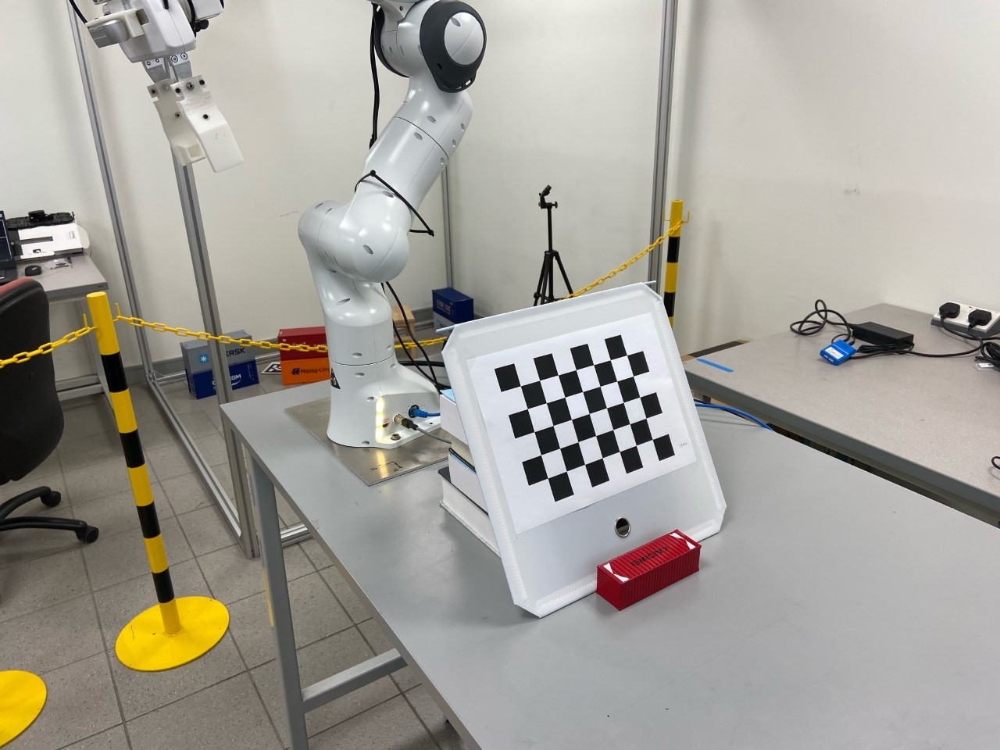

# Camera Calibration Toolbox
A toolbox for hand-eye calibration for camera on a manipulator.
It has been tested on UR5 and Franka Emika Panda robot.
Currently, it supports calibration on the Franka Emika Panda robot.
To setup the connection of RGBD camera, please refer to [this repository](https://github.com/hongtaowu67/Engineering_Note).

<p align="center">
  
</p>


## Installation
* [libfranka](https://frankaemika.github.io/docs/installation_linux.html) & [franka_ros](https://frankaemika.github.io/docs/installation_linux.html)
* [MoveIt](http://docs.ros.org/en/kinetic/api/moveit_tutorials/html/doc/getting_started/getting_started.html#install-ros-and-catkin)
* [openni_camera](http://wiki.ros.org/openni_camera) & [openni_launch](https://www.google.com/url?sa=t&rct=j&q=&esrc=s&source=web&cd=&ved=2ahUKEwj3_6XqvfDvAhXXR30KHdprC3cQFjAAegQIChAE&url=http%3A%2F%2Fwiki.ros.org%2Fopenni_launch&usg=AOvVaw18FvTTmJ3VTTl4SuD4bV0d): for PrimeSense camera
* [librealsense](https://github.com/IntelRealSense/librealsense/blob/master/doc/installation.md) & [realsense-ros](https://github.com/IntelRealSense/realsense-ros): for RealSense camera
* [OpenCV](https://opencv.org/releases/)
```
pip install opencv-python
```
* [panda_moveit_ctrl](https://github.com/ChirikjianLab/panda_moveit_ctrl) (Optional): ROS package to control the Franka Emika Panda robot. If you are using other robots, please follow **src/calibration_toolbox/panda_robot.py** to write your own robot class.
* [aruco_ros](https://github.com/pal-robotics/aruco_ros) (Optional): for aruco marker tracking. If you are using chessboard, this is not needed.

## Intrinsic Calibration
To calibrate instrinsic, follow the instruction in the [camera_calibration ROS package](http://wiki.ros.org/openni_launch/Tutorials/IntrinsicCalibration). If the camera is an RGBD camera, make sure to calibrate both the RGB and IR camera.

When using the [camera_calibration package](http://wiki.ros.org/openni_launch/Tutorials/IntrinsicCalibration), make sure to check the X, Y, Size, and Skew on the left of the window. Make sure all of them are turned green. Move the camera very closed to the chessboard. The distortion is most obvious when it is close to the chessboard.

## Franka Emika Panda Robot Extrinsic Calibration
This repository solves AXXB problem to get the extrinsic calibration problem.
It has been tested on Franka Emika Robot with both Intel RealSense D435 and PrimeSense Carmine 1.09.
The system we used in Ubunut 20.04.
To control the Panda robot, see the [panda_moveit_ctrl package](https://github.com/ChirikjianLab/panda_moveit_ctrl).
It consists of 2 steps: collecting data and solving AXXB. 
There are 3 options of calibration:
- ```EH```: eye-on-hand, calibrate the pose of the camera frame in the end-effector frame
- ```EBME```: eye-on-base, calibrate the pose of the marker in the end-effector frame
- ```EBCB```: eye-on-base, calibrate the pose of the camera in the base frame

### Data Collection
In the data collection part, the robot moves to different configurations and collects the transformation from the hand (end effector) to base and the corresponding transformation from camera to chessboard.

1. Generate and print the [calibration chessboard](https://calib.io/pages/camera-calibration-pattern-generator) or [aruco marker](https://chev.me/arucogen/). 
In our ```EBCM``` calibration, the grid size is 0.038mm. 
The number of columns and rows are 5 and 6. 
In our ```EH``` calibration, the grid size is 0.029mm.
The number of columns and rows are 6 and 8. 
In our ```EBME``` calibration, the grid size is 0.010mm.
The number of columns and rows are 5.
2. Attach the target onto a flat rigid plane and fix it on 1) the end effector of the robot for ```EBCB``` 2) table for ```EH``` 3) and hand for ```EBME```.
3. Move the robot to at least 15 configurations. 
Make sure in each configuration, the camera can see the whole target and the target is LARGE. 
Because if the target is too small, the estimation of pose will be inaccurate.
4. In **scripts/calib_collector_server_node**, specify the __target type__, the __data saving directory__, the txt file saving the __configuration points__ you collected and the __image topic__ of the camera.
If the calibration target is the chessboard, the pose of the chessboard will be detected later.
If the calibration target is the ArUco tag, the pose of the tag will be collected along the data collection.
**For PrimeSense 1.09, the rgb topic is "/camera/rgb/image_raw". For RealSense D435, the rgb topic is "/camera/color/image_raw".**
5. In **src/calib_collector.py**, specify the base and end-effector link.
6. Initialize the camera. To initialize PrimeSense 1.09,
```
roslaunch openni2_launch openni2.launch
```
To initialize RealSense D435,
```
roslaunch realsense2_camera rs_camera.launch
```
To check the image of the camera
```
rosrun image_view image_view image:=<image_topic>
```
7. (target=aruco) If you are using aruco marker for calibration, start the '''single''' node of '''aruco_ros''' to track the specified marker
```
roslaunch aruco_ros single.launch markerId:=<marker_id> markerSize:=<marker_size in meter>
```
Otherwise, skip this step.
8. Launch the Panda robot
```
roslaunch panda_moveit_config panda_control_moveit_rviz.launch robot_ip:=<robot_ip> load_gripper:=<true/false>
```
9. Run the [panda control server node](https://github.com/ChirikjianLab/panda_moveit_ctrl)
```
rosrun panda_moveit_ctrl panda_moveit_ctrl_server_node.py
```
10. Run the calib collector server
```
rosrun calibration_toolbox calib_collector_server_node.py
```
It will broadcast the ROS service "collect_data".
11. Call the service to collect data:
```
rosservice call /collect_data <data_directory>
```
The robot will move through the configurations and collect the data. 
After the collection process is finished, each image is paired with a robot pose file. 
The image filename is "x_img.png"/; the robot pose filename is "x_robotpose.txt".

### Chessboard Detection (Optional)
If your calibration target is the chessboard, the following will detect the pose of the chessboard in the camera frame in each collected image with the OpenCV.
If you are using aruco marker, skip this step.

1. Specify the __chessboard pattern__, __camera info yaml__, and __data directory__ in **src/calibration_toolbox/chessboard_detection.py**.
2. Run the chessboard detector
```
python chessboard_detector.py
```
The chessboard poses are saved in the data directory. 
marker poses are saved in "x_markerpose.txt".
Make sure the axis generated in all of the images are in the same corner of the chessboard.

### Solve AXXB to get the eye-to-hand transformation
The Park & Martin's method is used to solve AXXB problem.
1. Specify the __data directory__ and __calibration option__ in **scripts/main_calib_node.py**
2. Solve the AXXB problem
```
rosrun calibration_toolbox main_calib_node.py
```
The calibrated transformation will be saved in the data directory as ```pose.txt``` and ```pose.yaml```. 
Make sure to check each of the check pose in the terminal.
If the calibration is successful, they should be very close to each other.

## TODO
- [ ] Add images for the three experiment settings.
- [ ] Add an example yaml file.